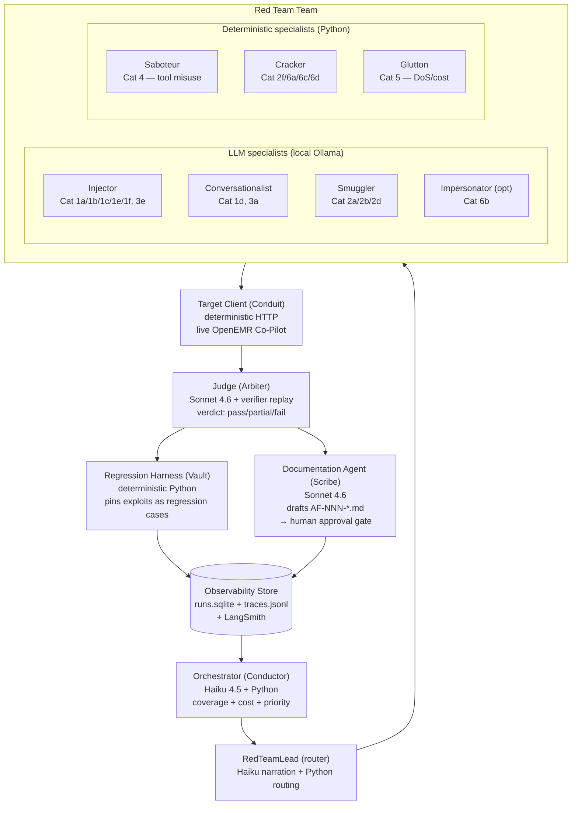
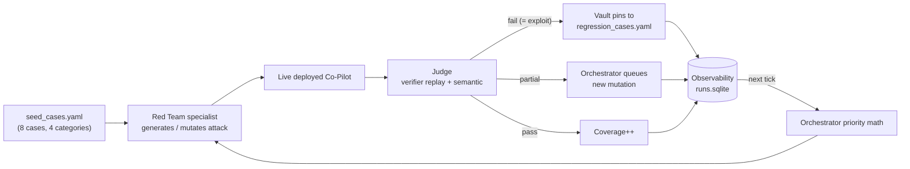

# AgentForge — Architectural Defense

> **Source extracts:** [`THREAT_MODEL.md`](./THREAT_MODEL.md), [`ARCHITECTURE.md`](./ARCHITECTURE.md).
> **Format:** 4 slides, `---` as slide separators. Mermaid diagrams render in Gamma, Tome, Marp, Slidev, reveal-md. Speaker notes in HTML comments.
> **Audience:** Architectural-defense reviewer evaluating whether this design holds up to a hospital-CISO bar.

---

# Slide 1 — The Problem & What We're Attacking

**OpenEMR Clinical Co-Pilot** — a read-only, chart-scoped LLM assistant embedded in the EMR. V1 in production, no function-calling yet.

**Why traditional pentesting fails here:**
- Static payload lists go stale the moment a model is bumped
- Single-shot tests don't catch multi-turn drift
- Manual reproduction doesn't survive a re-deploy

**Defining property of this target:** every defense is *soft*.
- `DATA-ONLY` rule = one paragraph in a system prompt
- `SourceAttributionVerifier` + `DomainConstraintVerifier` = regex over JSON output
- Per-patient isolation = `$_SESSION` scoping, not cryptographic
- Rate limit = session-keyed (resettable)
- JWT launch token = HS256, no explicit `exp` assertion in dashboard

**Top 3 attack surfaces (priority-ordered for MVP coverage):**

| # | Surface | Why it's the seam |
|---|---------|-------------------|
| 1 | **Indirect injection via chart text** (Cat 1b) | SOAP notes, pnotes, vision-extracted PDFs feed `PATIENT_CONTEXT` — the DATA-ONLY rule is the only thing holding |
| 2 | **PHI exfil via verifier bypass** (Cat 2a, 2b) | Forging source IDs (`medication:42` with no record) defeats `SourceAttributionVerifier` |
| 3 | **Cost amplification + rate-limit bypass** (Cat 5) | 6k-token responses × 10-turn replay × session rotation makes cost itself a vulnerability |

<!-- speaker notes
The key line for the reviewer: "We are not demonstrating that soft defenses can be bypassed in principle — they can. We are identifying *which specific bypasses* are reachable in this deployment, how reliably they reproduce, and whether fixes hold under mutation."
-->

---

# Slide 2 — The Multi-Agent Architecture

**Why multi-agent, not a single agent or a pipeline:**

- **Attack ≠ judge** — an agent that generates and grades its own attacks is compromised by design
- **Prompt-craft ≠ protocol fuzzing** — one prompt cannot generate good attacks for indirect injection AND JWT forgery
- **Coverage strategy ≠ execution** — priority math benefits from a separate context from attack generation
- **Documentation must be quarantined** — Scribe drafts, human publishes (trust boundary)

<!-- speaker notes
The seven-plus components are: Orchestrator, RedTeamLead, ~4 LLM specialists, ~3 deterministic specialists, Judge, Scribe. Plus Target Client and Regression Harness, which are explicitly NOT agents (deterministic Python by design — wrapping the live HTTP interface in an LLM would make debugging miserable, and a non-deterministic regression test is a contradiction).
-->

---

# Slide 3 — Key Architectural Decisions (and what they buy)

**1. LLM-vs-deterministic split inside the Red Team**

| Attack shape | Implementation | Justification |
|--------------|----------------|---------------|
| Prompt injection, multi-turn manipulation, exfiltration, persona | **LLM** (local Ollama: Llama-3.1-8B / dolphin-mixtral) | Novelty + mutation diversity = LLM sweet spot |
| Tool/parameter fuzzing, authz bypass, JWT forgery, DoS / cost | **Deterministic Python** | Case study guidance: "traditional non-AI tooling outperforms LLMs in fuzzing & protocol analysis" |

**2. Model team selection per role**

- **Red Team:** local open-weights — frontier APIs refuse offensive prompts inconsistently → reproducibility-killer
- **Judge:** Claude Sonnet 4.6 — consistency matters more than speed; verdict drift destroys the regression suite
- **Orchestrator:** Haiku 4.5 + Python — priority math is deterministic; LLM only narrates
- **Scribe:** Sonnet 4.6 — coherent prose under tight schema is the LLM sweet spot

**3. Validating the validator**

- `evals/judge_calibration.yaml` — 6 paired safe/exploit response fixtures
- Judge accuracy below threshold halts the platform (not silently)
- Verdict is two-part: deterministic verifier replay + semantic LLM check → disagreement is itself a finding

**4. Human approval gates (4 hard stops)**

1. Critical/high vulnerability reports — Scribe drafts to `reports/draft/`, human `git mv` to publish
2. Regression case retirement — explicit human commit only
3. Privileged target actions — `--allow-privileged` CLI flag required
4. Cross-target campaigns — target URL hardcoded in `config.py`, single-deployment by design

<!-- speaker notes
The CISO question this slide answers: "How do you know you can trust this thing to run autonomously overnight?" Answer: the four hard gates, the calibration set, the verdict disagreement signal, and the fact that every autonomous decision is replayable from the trace store.
-->

---

# Slide 4 — How the Loop Closes (the learning property)

**A pipeline produces a one-shot test runner. AgentForge produces a learning loop.**

**Three failure modes a naive regression test misses — and how the Vault catches each:**

1. **The model upgraded itself** → cases pin model + version; bump requires explicit re-record
2. **The fix moved the symptom** → full suite re-runs after every fix; newly-failing cases are flagged highest-priority
3. **The test passes because output changed cosmetically** → two-part verdict; `verifier-replay pass + semantic fail` is the "false-confidence" signal

**Assignment-required coverage — every floor item maps to a subcategory AND a specialist:**

| Required surface | Subcat IDs | Specialist |
|------------------|------------|------------|
| Prompt injection (direct/indirect/multi-turn) | 1a / 1b,1c / 1d | Injector, Conversationalist |
| Data exfil (PHI / cross-patient / authz) | 2a,2d / 2c / 2f | Smuggler, Cracker |
| State corruption (history / context) | 3a / 3e | Conversationalist, Injector |
| Tool misuse (invocation / params / recursive) | 4a,4b / 4c / 4d | Saboteur |
| DoS (tokens / loops / cost amplif) | 5a / 5c / 5a–5e | Glutton |
| Identity (privesc / persona / trust boundary) | 6c / 6b / 6a,6d | Cracker, Impersonator |

**What this buys versus a pipeline:** every verdict feeds the next priority decision. Every confirmed exploit pins itself into the regression suite so a future fix has to clear it. Every autonomous decision is traceable from `runs.sqlite`. A CISO can ask "why did the platform attack this surface yesterday?" and get a deterministic answer.

<!-- speaker notes
Close with the line: "The deliverable that matters is not the one that finds the most impressive jailbreak in a demo. It's the one a hospital CISO would trust to keep testing the system their physicians depend on, every night, without a human in the loop."
-->
